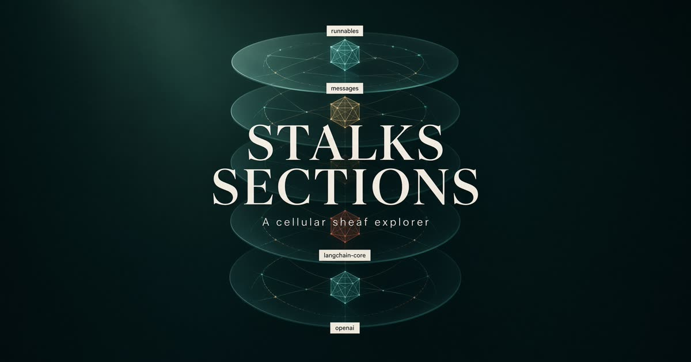

# Stalks & Sections

A full-viewport **WebGL** explorer of **cellular sheaves** on a hierarchical knowledge graph.

Nodes are stalks — finite-dimensional vector spaces of their own size (dim 2–16). Edges are typed restriction maps. Edge colour and thickness are the residual of the sheaf Laplacian. Only approximate global sections survive as trusted knowledge.



## Why this exists

Most knowledge-graph viewers flatten every entity into a point in one ambient space. A cellular sheaf does not. Each cell keeps its own fibre; comparison happens through restriction maps, not a forced embedding. Residuals of those maps — the Dirichlet energy of the assignment — are first-class data, not decoration.

This app makes that algebra tangible:

- **Four hierarchy planes** (Foundations → Sheaf theory → Applications → Viz & integrity)
- **Stalk dimension → node size**, **level → ordered hue**, **residual → diverging teal–terracotta**
- **Diffuse** — degree-normalised Euler descent on the sheaf Laplacian (Cobb–Gebhart Thm 3.2)
- **Exact solve** — closed-form harmonic extension on the Cobb–Gebhart TransE seed (Thm 3.1)
- **Coarsen** — HiSP-style hierarchical pooling that conserves low-frequency modes
- **Hide noise** — drop high-residual restrictions so only near-sections remain

## Run

```bash
npm install
npm run dev
```

Then open the printed local URL. `npm run typecheck` and `npm run build` are the gates.

### Grok Build / migrate

Wired for [Grok Build](https://docs.x.ai/build/overview): `AGENTS.md` at the root, skills under `.grok/skills/`. Unzip-and-continue: **[MIGRATE.md](MIGRATE.md)**. Enhancement contract: **[HANDOFF.md](HANDOFF.md)**.

```bash
git clone https://github.com/manutej/stalks-and-sections.git
cd stalks-and-sections
npm install
grok inspect    # AGENTS.md + sheaf-ingest + sheaf-enhance
grok
```

### Add a knowledge graph

```bash
cp templates/kg/triples.json /tmp/my-kg.json
npm run sheaf:generate -- --from /tmp/my-kg.json --out docs/examples/my-kg.json
npm run sheaf:validate -- docs/examples/my-kg.json
```

Full contract: **[docs/GENERATE.md](docs/GENERATE.md)** — schema, templates, wiki import, restriction kinds.

| Script | What it does |
| --- | --- |
| `npm run dev` | Vite + TanStack Start, bound on `0.0.0.0:8080` |
| `npm run typecheck` | `tsc --noEmit` |
| `npm run build` | Production client + server bundle |
| `npm run preview` | Serve the production build |
| `npm run sheaf:generate` | Compile triples / CSV / wiki → sheaf JSON |
| `npm run sheaf:examples` | Regenerate shipped example graphs |
| `npm run sheaf:validate` | Check a sheaf JSON against the contract |

## How to read the lattice

| You see | It means |
| --- | --- |
| Stacked glass planes | Hierarchy levels L0–L3 |
| Node size | Stalk dimension \(\dim F(v)\) |
| Node hue | Ordered level (teal foundations → terracotta integrity) |
| Ring around a node | Pinned / known stalk (boundary for harmonic extension) |
| Edge colour | Restriction residual: teal = consistent, terracotta = noisy |
| Paper-chip names | Labels on the **topmost visible layer** — peel **Layers** to read below |
| Inspector plot | The stalk projected onto a stable 2D orthonormal basis |

**Leave a stalk** with Close, Esc, a second click on the same node, or an empty layer plane.

Every control has a `?`. **Guide** lists them all.

## Architecture (where to enhance)

```
src/lib/sheaf/          # algebra — graphs, maps, energy, diffuse, pool, layout
src/store/sheaf.ts      # zustand: dataset, selection, operators, energy log
src/components/sheaf/   # WebGL scene + DOM chrome
  canvas/Scene.tsx      # R3F lattice, labels, planes
  chrome/               # dock, inspector, guide, hints
```

Start at [`HANDOFF.md`](HANDOFF.md) if you are about to change the explorer. Architecture: [`docs/ARCHITECTURE.md`](docs/ARCHITECTURE.md). Enhancement backlog: [`ROADMAP.md`](ROADMAP.md). How to add a graph: [`docs/DATASETS.md`](docs/DATASETS.md).

Literature notes that seeded the lattice are in [`docs/sources/`](docs/sources/). Example JSON sheaves (discourse triangle, schema) live in [`docs/examples/`](docs/examples/).

## Mathematical notes

A cellular sheaf \(F\) on a graph assigns a vector space \(F(v)\) to each vertex and a linear map \(F_{v \triangleleft e}: F(v) \to F(e)\) to each incidence. The coboundary of an assignment \(x\) is

\[
(\delta x)_e = F_{s \triangleleft e}\, x_s - F_{t \triangleleft e}\, x_t
\]

(plus a translation term for TransE-style restrictions). Dirichlet energy \(E(x) = \sum_e \|\delta x_e\|^2\) is the quadratic form of the sheaf Laplacian \(L_F\). Global sections are \(\ker L_F\). Diffuse walks unknown stalks toward that kernel with known stalks frozen; the Cobb graph admits a closed form.

Primary sources: Hansen–Ghrist; Cobb–Gebhart [arXiv:2309.03773](https://arxiv.org/abs/2309.03773); Neural Sheaf Diffusion; HiSP / HETSHEAF. See [`docs/sources/SOURCES.md`](docs/sources/SOURCES.md).

## Stack

React 19 · TanStack Start · Three.js + React Three Fiber · Zustand · Tailwind v4

## License

MIT. See [LICENSE](LICENSE).
